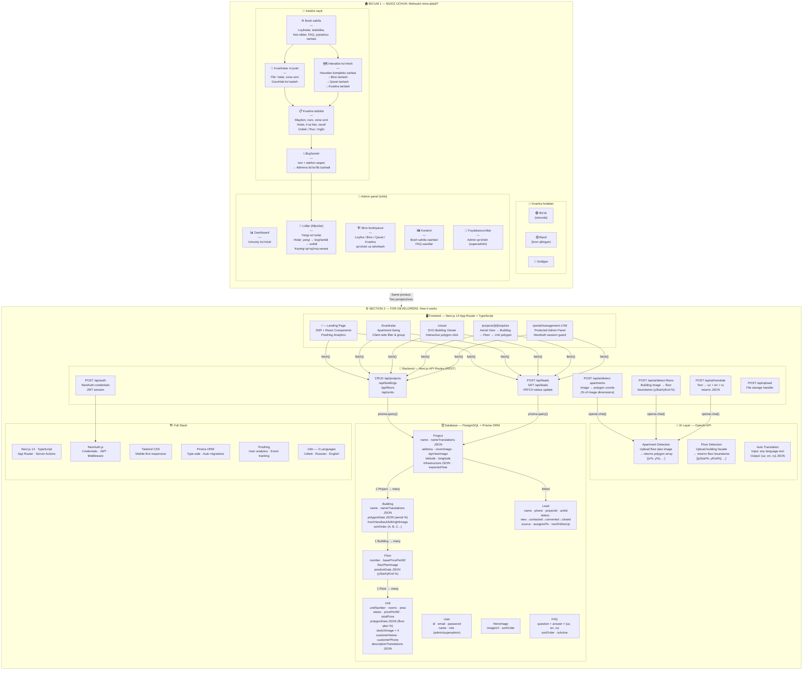

# UY-JOY — Eraser.io Diagram
# Copy everything inside the code block into eraser.io

---

**Paste instructions:**
1. Copy everything inside the triple backticks above
2. Go to [app.eraser.io](https://app.eraser.io) → New file → **Diagram**
3. Paste → renders as Mermaid flowchart
4. Export as PNG or PDF
